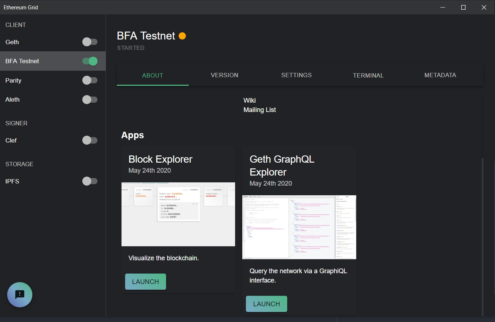
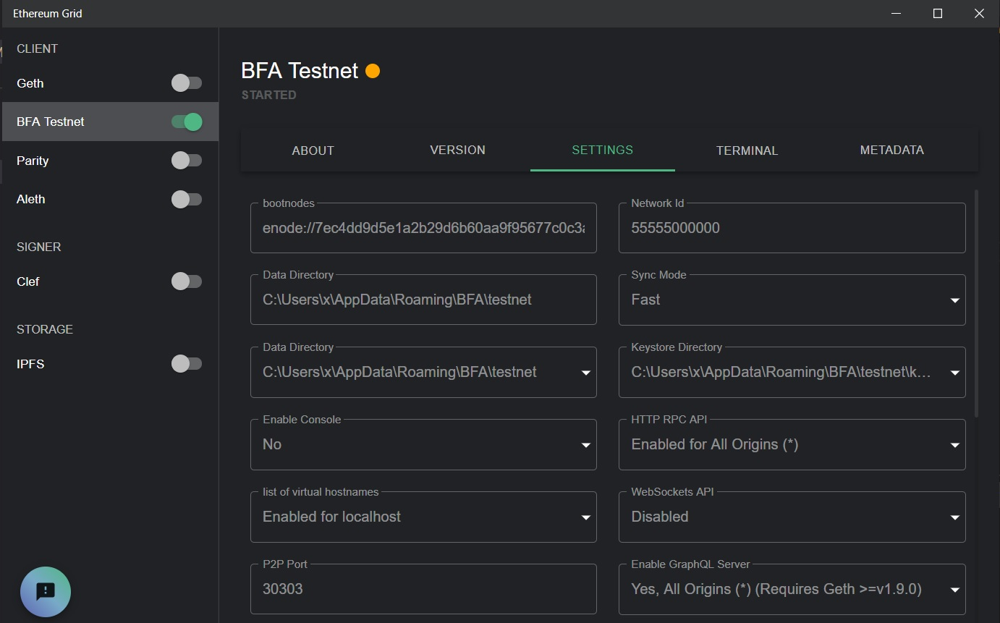
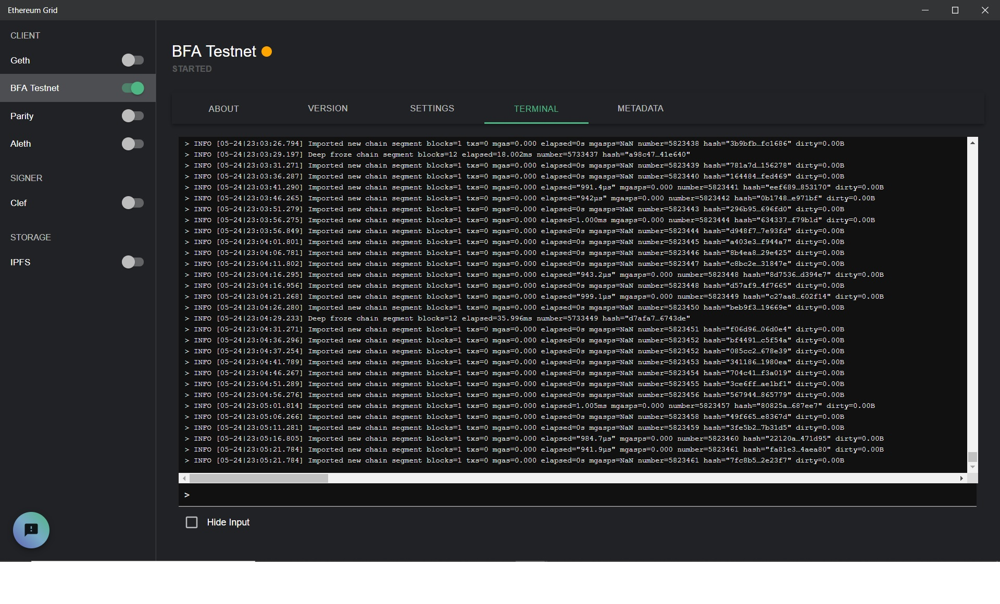

# Plugin para la herramienta [Grid](https://grid.ethereum.org/) que gestiona un nodo Geth conectado a la Blockchain Federal Argentina (BFA) sobre la Testnet. 

## Description
Utilizando **Grid** junto con este plugin podemos gestionar rápidamente el inicio, sincronización y gestión de los parámetros básicos utilizados con [geth](https://geth.ethereum.org/) para el establecimiento de un "client" Ethereum con acceso al ambiente de Testnet de la **Blockchain Federal Argentina**.

La herramienta [Grid](https://grid.ethereum.org/) es una interesante herramienta que más alla de encontrarse **aún en una etapa de evolución** nos facilita la ejecución de diferentes herramientas del ecosistema Ethereum.

  

## Prerequisitos

- Proceder a la descarga e instalación de la herramienta **Grid** desde esta página [https://grid.ethereum.org/](https://grid.ethereum.org/). Este plugin ha sido probado con **Grid v1.6.2**

## Instalación del plugin sobre Grid según ambiente

#### Linux (Portable)
  - Sobreescribir el archivo **$HOME/.config/grid/config.json** generado en la instalación con esta nueva versión 
  [appimage/config.json](appimage/config.json)

#### Linux (debian)
  - Sobreescribir el archivo **/opt/Grid/resources/app/ethereum_clients/client_plugins\plugins.json** generado en la instalación con esta nueva versión [debian/plugins.json](debian/plugins.json)

#### Windows (zip)
  - Sobreescribir el archivo **<Path de instalación>resources\app\ethereum_clients\client_plugins\plugins.json** generado en la instalación con esta nueva versión [win/plugins.json](win/plugins.json)

#### Windows Installer
  - Sobreescribir el archivo **%APPDATA%\Local\Programs\grid\resources\app\ethereum_clients** generado en la instalación con esta nueva versión [win/plugins.json](win/plugins.json)

 

### Potencial error en el inicio de la herramienta

Si **Grid** no tiene acceso a Internet para descargar alguno de los plugins definidos en el archivo **plugins.json** el inicio quedará suspendido indefinidamente. Una alternativa para resolver este escenario es editando el archivo **plugins.json** eliminando los plugins no utilizados.

Ejemplo minimal

**plugins.json**
~~~json
[
  {
    "name": "BFA.testnet",
    "displayName": "BFA Testnet",
    "type": "client",
    "author": {
      "name": "Gonzalo Bellino",
      "email": "",
      "address":"51632f2eb5e91324594bae47172e77030f014f1d"
  },
    "location": "https://github.com/gonzalobellino/grid-bfa-plugin"
  }
]

~~~

### Directorio de destino default de la base de datos para BFA.testnet

Por default el directorio se creara según el sistema operativo de destino en los siguientes directorios:

 - Linux --> ~/.BFA/testnet
 - Windows --> %APPDATA%/BFA/testnet (env.APPDATA ej: --> c:/Users/Guest/AppData/Roaming/)
 - darwin --> ~/Library/BFA/testnet

 

## Uso

Luego de iniciar [Ethereum Grid ](https://grid.ethereum.org/) deberiamos visualizar ua lista de herramientas y clientes disponibles para ser gestionadas, incluida una opción nueva denominada "BFA Testnet"

Desde la opción BFA Testnet ademas de iniciar el cliente Geth pre configurado también podremos utilizar un explorador de bloques y un cliente GraphQL (se recomienda aguardar a la sincronización de la cadena para su uso)

Utilizando la pestaña "settings" se pueden observar los distintos parámetros de personalización para ajustar la ejecución del cliente Geth.

También es posible visualizar la terminal con información de "logging"

Si la base de datos se encuentra en modo "sincronización" es importante realizar una detención de la misma antes de cerrar la herramienta, para evitar que la base de datos quede corrupta.

